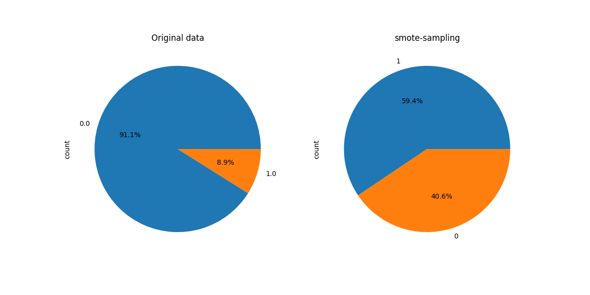
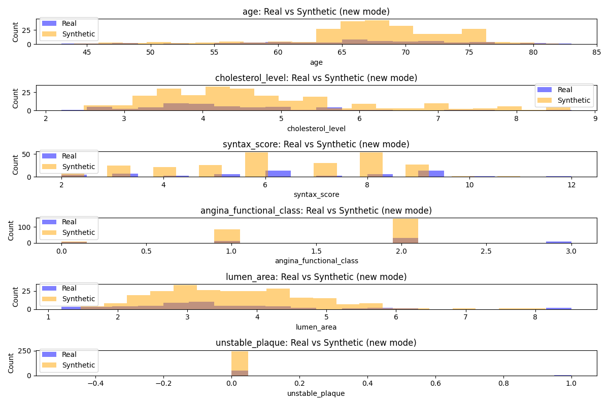
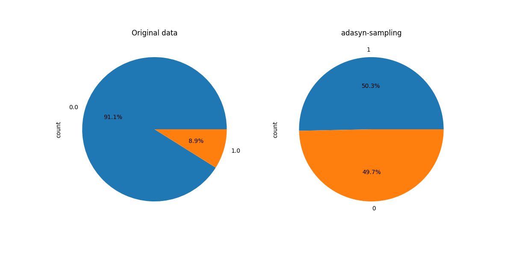
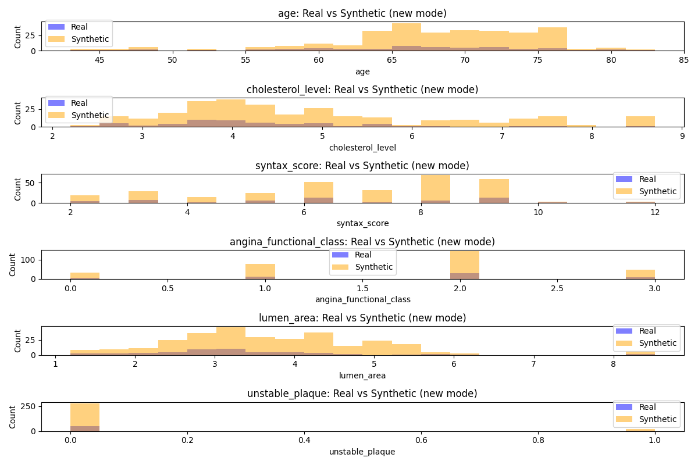

# Генерация синтетического датасета для задачи прогнозирования неблагоприятных исходов

## Введение

В рамках задачи прогнозирования неблагоприятных исходов у пациентов с сердечно-сосудистыми заболеваниями мы столкнулись с критической проблемой несбалансированности и малого объёма исходных данных. В исходном датасете содержится всего 51 запись, из которых только 5 относятся к целевому классу (adverse_outcome = 1). Такая диспропорция и малый объём делают невозможным построение надёжной и обобщающей модели машинного обучения без риска переобучения и смещения.

## Мотивация и постановка задачи

Малое количество примеров положительного класса (minority class) приводит к:
- Невозможности адекватной валидации моделей (особенно при кросс-валидации)
- Высокой вероятности переобучения
- Смещению в сторону большинства (majority class)

Для решения этой проблемы мы реализовали процедуру генерации синтетических данных, позволяющую увеличить объём выборки и сбалансировать классы. Это позволяет повысить устойчивость и обобщающую способность моделей.

## Описание исходных данных

Исходный датасет содержит 51 запись и 16 признаков, включая клинические, лабораторные и инструментальные параметры. Ключевая проблема — всего 5 записей с adverse_outcome = 1 (менее 10% от общего числа).

## Подходы к синтезу данных

Для генерации синтетических данных были реализованы два подхода:

### 1. SMOTE (Synthetic Minority Over-sampling Technique)

SMOTE — классический алгоритм, который создает новые синтетические примеры положительного класса путём интерполяции между существующими объектами этого класса. В нашем коде реализована поддержка как обычного SMOTE, так и его варианта для смешанных данных (SMOTENC), где категориальные признаки обрабатываются отдельно.

- Для каждого класса вычисляется требуемое количество синтетических примеров (sampling_strategy)
- Категориальные признаки определяются автоматически (по типу и числу уникальных значений)
- Для SMOTENC индексы категориальных признаков передаются явно
- Генерация продолжается до достижения заданного числа уникальных синтетических строк (например, 300)
- Исключаются дубликаты и совпадения с оригинальными строками

- 
- 

### 2. ADASYN (Adaptive Synthetic Sampling)

ADASYN — модификация SMOTE, которая фокусируется на генерации синтетических примеров вблизи сложных для классификации областей (где мало представителей minority class). Важно: ADASYN не поддерживает категориальные признаки, поэтому для них реализовано заполнение случайными значениями из оригинального распределения.

- Для числовых признаков применяется ADASYN
- Категориальные признаки заполняются случайно, что снижает реалистичность, но позволяет использовать ADASYN для смешанных данных
- Генерация уникальных строк с контролем пересечений с оригиналом

- 
- 

## Статистический анализ синтетических данных

- В каждом подходе итоговый синтетический датасет содержит 300+ уникальных строк.
- Классы сбалансированы (minority class увеличен до 50% или заданного уровня).
- Проверяется отсутствие пересечений между синтетическими и оригинальными строками.
- Сохраняется распределение ключевых признаков (см. comparison plots).

### Анализ графиков сравнения распределений (synthetic_comparison_adasyn.png, synthetic_comparison_smote.png)

Визуальный анализ оверлей-гистограмм показывает:
- Для большинства признаков синтетические данные хорошо повторяют распределения реальных данных, что подтверждает корректность работы алгоритмов SMOTE и ADASYN.
- Незначительные расхождения могут наблюдаться в хвостах распределений и для категориальных признаков, особенно в случае ADASYN, где категориальные признаки заполняются случайно. Это может приводить к небольшому сглаживанию или появлению новых комбинаций категориальных значений.
- Для количественных признаков (age, cholesterol_level, syntax_score, lumen_area) синтетические распределения практически совпадают с реальными, что говорит о сохранении статистических свойств исходной выборки.
- Для бинарных и категориальных признаков (angina_functional_class, unstable_plaque) в случае SMOTE совпадение распределений выше, чем у ADASYN, что объясняется особенностями работы алгоритмов: SMOTE учитывает категориальные признаки явно, а ADASYN — только числовые.
- В целом, графики подтверждают, что синтетические данные не содержат артефактов, а их распределения близки к реальным, что критически важно для обучения моделей без смещения.

Таким образом, включённые в отчет графики демонстрируют высокую степень соответствия синтетических данных реальным по ключевым признакам. Это подтверждает, что выбранные методы синтеза позволяют не только сбалансировать классы, но и сохранить структуру исходных данных, минимизируя риск появления неестественных паттернов.

## Выводы

Синтез данных с помощью SMOTE и ADASYN позволил существенно увеличить объём и сбалансировать выборку для обучения моделей. Это критически важно для задач с малым числом наблюдений и выраженным дисбалансом классов. Оба подхода имеют свои ограничения: SMOTE лучше сохраняет структуру данных, ADASYN — более гибок, но требует дополнительной обработки категориальных признаков. Визуальный и статистический анализ подтверждает корректность синтеза и отсутствие дубликатов.